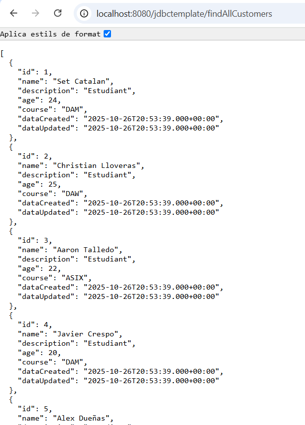
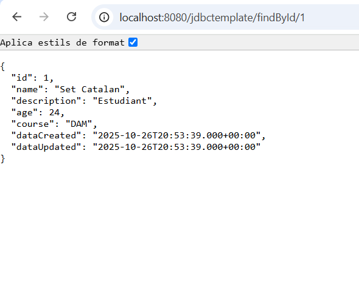
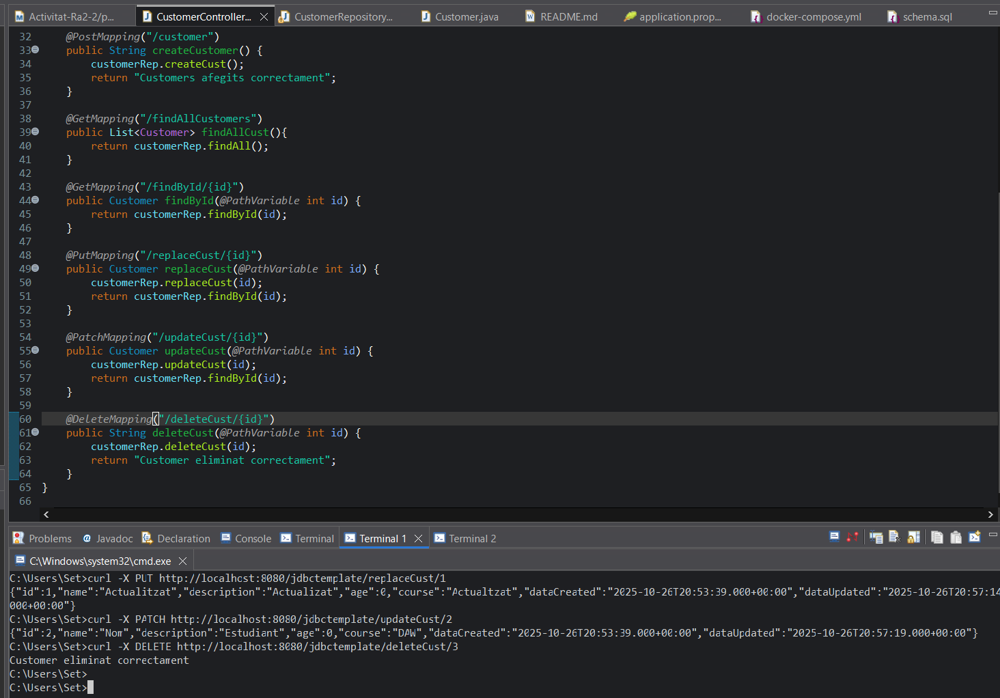
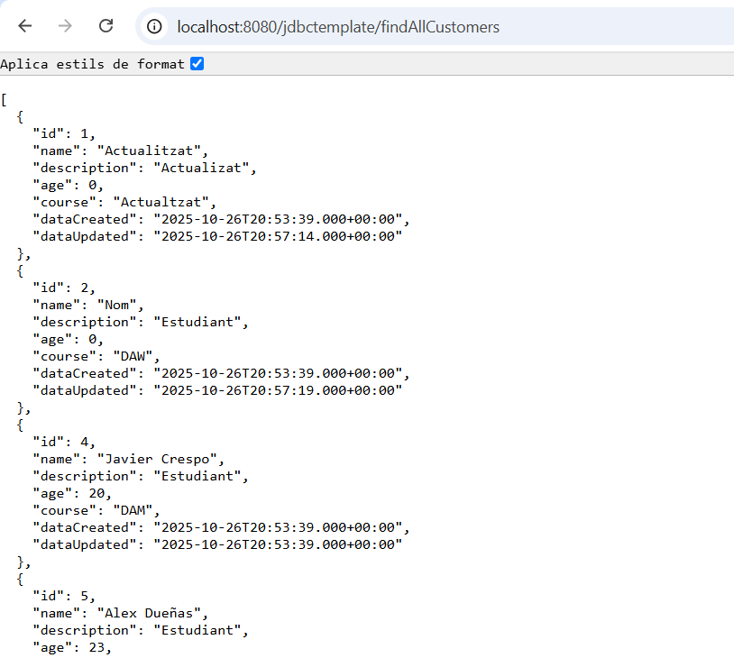

# spring_jdbc_mysql

### Set Catalán Ribolleda

## Create - Crear nou customer

## Read - Obtenir tota la taula customers

## Read by ID - Obtenir un customer segons l’id

## UPDATE complet - Actualització completa de customer

## UPDATE parcial - Modificació age i name

## DELETE - Esborrar customer

### Resultat dels tres ùltims endpoints

